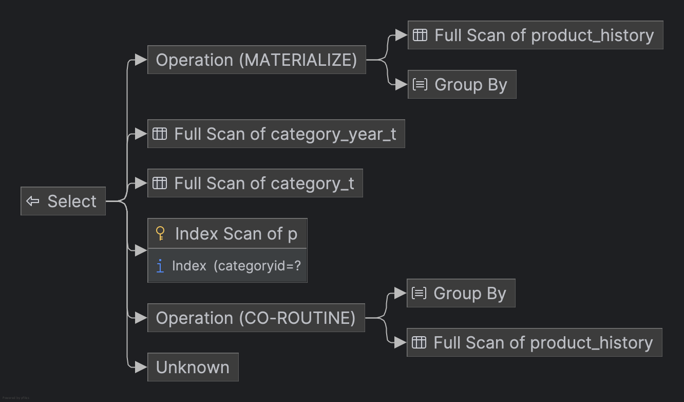
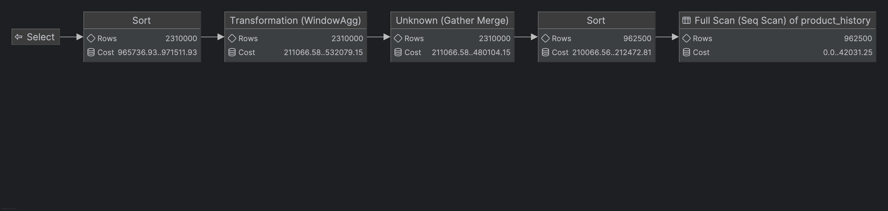

## SQL - Funkcje okna (Window functions) <br> Lab 2

---

**Imiona i nazwiska:**
- Jakub Barber

--- 


Celem ćwiczenia jest zapoznanie się z działaniem funkcji okna (window functions) w SQL, analiza wydajności zapytań i porównanie z rozwiązaniami przy wykorzystaniu "tradycyjnych" konstrukcji SQL

Swoje odpowiedzi wpisuj w miejsca oznaczone jako:

---
> Wyniki: 

```sql
--  ...
```

---

### Ważne/wymagane są komentarze.

Zamieść kod rozwiązania oraz zrzuty ekranu pokazujące wyniki, (dołącz kod rozwiązania w formie tekstowej/źródłowej)

Zwróć uwagę na formatowanie kodu

---

## Oprogramowanie - co jest potrzebne?

Do wykonania ćwiczenia potrzebne jest następujące oprogramowanie:
- MS SQL Server - wersja 2019, 2022
- PostgreSQL - wersja 15/16/17
- SQLite
- Narzędzia do komunikacji z bazą danych
	- SSMS - Microsoft SQL Managment Studio
	- DtataGrip lub DBeaver
-  Przykładowa baza Northwind/Northwind3
	- W wersji dla każdego z wymienionych serwerów

Oprogramowanie dostępne jest na przygotowanej maszynie wirtualnej

## Dokumentacja/Literatura

- Kathi Kellenberger,  Clayton Groom, Ed Pollack, Expert T-SQL Window Functions in SQL Server 2019, Apres 2019
- Itzik Ben-Gan, T-SQL Window Functions: For Data Analysis and Beyond, Microsoft 2020

- Kilka linków do materiałów które mogą być pomocne
	 - [https://learn.microsoft.com/en-us/sql/t-sql/queries/select-over-clause-transact-sql?view=sql-server-ver16](https://learn.microsoft.com/en-us/sql/t-sql/queries/select-over-clause-transact-sql?view=sql-server-ver16)
	- [https://www.sqlservertutorial.net/sql-server-window-functions/](https://www.sqlservertutorial.net/sql-server-window-functions/)
	- [https://www.sqlshack.com/use-window-functions-sql-server/](https://www.sqlshack.com/use-window-functions-sql-server/)
	- [https://www.postgresql.org/docs/current/tutorial-window.html](https://www.postgresql.org/docs/current/tutorial-window.html)
	- [https://www.postgresqltutorial.com/postgresql-window-function/](https://www.postgresqltutorial.com/postgresql-window-function/)
	- [https://www.sqlite.org/windowfunctions.html](https://www.sqlite.org/windowfunctions.html)
	- [https://www.sqlitetutorial.net/sqlite-window-functions/](https://www.sqlitetutorial.net/sqlite-window-functions/)


- W razie potrzeby - opis Ikonek używanych w graficznej prezentacji planu zapytania w SSMS jest tutaj:
	- [https://docs.microsoft.com/en-us/sql/relational-databases/showplan-logical-and-physical-operators-reference](https://docs.microsoft.com/en-us/sql/relational-databases/showplan-logical-and-physical-operators-reference)

## Przygotowanie

Uruchom SSMS
- Skonfiguruj połączenie  z bazą Northwind na lokalnym serwerze MS SQL 

Uruchom DataGrip (lub Dbeaver)
- Skonfiguruj połączenia z bazą Northwind3
	- na lokalnym serwerze MS SQL
	- na lokalnym serwerze PostgreSQL
	- z lokalną bazą SQLite

Można też skorzystać z innych narzędzi klienckich (wg własnego uznania)

Oryginalna baza Northwind jest bardzo mała. Warto zaobserwować działanie na nieco większym zbiorze danych.

Baza Northwind3 zawiera dodatkową tabelę product_history
- 2,2 mln wierszy

Bazę Northwind3 można pobrać z moodle (zakładka - Backupy baz danych)

Można też wygenerować tabelę product_history przy pomocy skryptu

Skrypt dla SQL Srerver

Stwórz tabelę o następującej strukturze:

```sql
create table product_history(
   id int identity(1,1) not null,
   productid int,
   productname varchar(40) not null,
   supplierid int null,
   categoryid int null,
   quantityperunit varchar(20) null,
   unitprice decimal(10,2) null,
   quantity int,
   value decimal(10,2),
   date date,
 constraint pk_product_history primary key clustered
    (id asc )
)
```

Wygeneruj przykładowe dane:

Dla 30000 iteracji, tabela będzie zawierała nieco ponad 2mln wierszy (dostostu ograniczenie do możliwości swojego komputera)

Skrypt dla SQL Srerver

```sql
declare @i int  
set @i = 1  
while @i <= 30000  
begin  
    insert product_history  
    select productid, ProductName, SupplierID, CategoryID,   
         QuantityPerUnit,round(RAND()*unitprice + 10,2),  
         cast(RAND() * productid + 10 as int), 0,  
         dateadd(day, @i, '1940-01-01')  
    from products  
    set @i = @i + 1;  
end;  
  
update product_history  
set value = unitprice * quantity  
where 1=1;
```


Skrypt dla Postgresql

```sql
create table product_history(
   id int generated always as identity not null  
       constraint pkproduct_history
            primary key,
   productid int,
   productname varchar(40) not null,
   supplierid int null,
   categoryid int null,
   quantityperunit varchar(20) null,
   unitprice decimal(10,2) null,
   quantity int,
   value decimal(10,2),
   date date
);
```

Wygeneruj przykładowe dane:

Skrypt dla Postgresql

```sql
do $$  
begin  
  for cnt in 1..30000 loop  
    insert into product_history(productid, productname, supplierid,   
           categoryid, quantityperunit,  
           unitprice, quantity, value, date)  
    select productid, productname, supplierid, categoryid,   
           quantityperunit,  
           round((random()*unitprice + 10)::numeric,2),  
           cast(random() * productid + 10 as int), 0,  
           cast('1940-01-01' as date) + cnt  
    from products;  
  end loop;  
end; $$;  
  
update product_history  
set value = unitprice * quantity  
where 1=1;
```


Wykonaj polecenia: `select count(*) from product_history`,  potwierdzające wykonanie zadania

---
> Wyniki: 

```sql
--  ...
```

---

# Zadanie 1

Baza: Northwind, tabela product_history

Napisz polecenie, które zwraca: id pozycji, id produktu, nazwę produktu, id_kategorii, cenę produktu, średnią cenę produktów w kategorii do której należy dany produkt. Wyświetl tylko pozycje (produkty) których cena jest większa niż średnia cena.

W przypadku długiego czasu wykonania ogranicz zbiór wynikowy do kilkuset/kilku tysięcy wierszy

pomocna może być konstrukcja ` with `

```sql
with t as (

....
)
select * from t
where id between ....
```

Napisz polecenie z wykorzystaniem podzapytania, join'a oraz funkcji okna. Porównaj zapytania. Porównaj czasy oraz plany wykonania zapytań.

Przetestuj działanie w różnych SZBD (MS SQL Server, PostgreSql, SQLite)


---
> Wyniki: 

```sql
-- Window function
with t as (SELECT id,
                  productname,
                  categoryid,
                  unitprice,
                  AVG(unitprice) OVER (PARTITION BY categoryid) as avg_price_per_category
           FROM product_history)
select id, productname, categoryid, unitprice, avg_price_per_category
from t
where unitprice > avg_price_per_category;


-- JOIN
with t as (SELECT categoryid,
                  AVG(unitprice) as avg_price_per_category
           FROM product_history
           GROUP BY categoryid)
select id, productname, t.categoryid, unitprice, avg_price_per_category
from t
         INNER JOIN product_history p on t.categoryid = p.categoryid
where unitprice > avg_price_per_category;


-- SUBQUERY
with t as (SELECT p2.id,
                  p2.productname,
                  p2.categoryid,
                  p2.unitprice,
                  (SELECT AVG(unitprice)
                   from product_history p1
                   WHERE p1.categoryid = p2.categoryid) as avg_price_per_category
           FROM product_history p2)
select id, productname, categoryid, unitprice, avg_price_per_category
from t
where unitprice > avg_price_per_category;
```

---


## Porównanie czasów wykonania zapytań

| SZBD       | Funkcja okna (Window Function) | Podzapytanie (Subquery) (przy ograniczeniu dla zakresu id 1:100)| JOIN  |
|------------|--------------------------------|--------------------------|-------|
| MS SQL     | 3 000 ms                          | 9 0000 ms                    | 1 120 ms  |
| PostgreSQL | 758 ms                          | 14 000 ms                | 640 ms ms  |
| SQLite     | 970 ms                          | 16 000 ms                    | 770 ms  |

\* wartości przyblione dla kilku uruchomień zapytań przy pomocy narzędzia **DataGrip**.

Zgodnie z oczekiwaniami, zapytanie które korzysta z podzapytania jako głównego warunku, osiąga najgorsze rezultaty.
Wynika to z faktu e to podzapytanie wykonuje się za kadym razem dla kadego wiersza w tabeli, co 
prowadzi ddo znacznie gorsdzego performance'u.
W zaleznosci od róznych silników bazy danych, zapytania zajmują rozna ilosc czasu - wydaje sie ze najlepiej wypada w benchmarku zapytanie przy pomocy JOIN, nastepnie Funkcji okna, a najgorze wyniki osiąga 
wariant korzystający z podzapytań.

## Porównanie query planów
W przypadku wariantu z podzapytaniem, dodatkowo ograniczam wynik zapytania dodatkoywm warunkiem w klauzuli
WHERE: `id between 1 AND 100`.

### Porównanie wyników dla różnych SZBD

#### MS SQL Server

##### Funkcja okna (Window Function)


##### JOIN


##### Podzapytanie (Subquery)


---

#### PostgreSQL

##### Funkcja okna (Window Function)

##### JOIN


##### Podzapytanie (Subquery)


---

#### SQLite

##### Funkcja okna (Window Function)


##### JOIN


##### Podzapytanie (Subquery)


### Podsumowanie
Porównując query plany, widzimy ze w kazdym przypadku rozwiazanie z funkcją okna, ma podobny koszt 
do rozwiazania przy uzyciu JOINa. W przypadku zastosowania JOINA, mamy w query planie 2 Full index Scany,
a samo łączenie wynikow odbywa sie przy pomocy Hash Joina co znacznie przyspiesza czas zapytania.
Dla Funkcji okna, mamy teoretycznie tylko jeden Full Index Scan, ale za to mamy Nested Loop ktory zwieksza czas wykonania operacji.
Dla naszych danych, lepsze wyniki osiagnelismy dla zapytan z JOINami.

# Zadanie 2

Baza: Northwind, tabela product_history

Lekka modyfikacja poprzedniego zadania

Napisz polecenie, które zwraca: id pozycji, id produktu, datę, nazwę produktu, id_kategorii, cenę produktu oraz
-  średnią cenę produktów w kategorii do której należy dany produkt.
-  łączną wartość sprzedaży produktów danej kategorii (suma dla pola value)
-  średnią cenę danego produktu w roku którego dotyczy dana pozycja
-  łączną wartość sprzedaży produktu w roku którego dotyczy dana pozycja (suma dla pola value)

Napisz polecenie z wykorzystaniem podzapytania, join'a oraz funkcji okna. Porównaj zapytania. W przypadku funkcji okna spróbuj użyć klauzuli WINDOW.

Podobnie jak poprzednio, w przypadku długiego czasu wykonania ogranicz zbiór wynikowy do kilkuset/kilku tysięcy wierszy

Porównaj czasy oraz plany wykonania zapytań.

Przetestuj działanie w różnych SZBD (MS SQL Server, PostgreSql, SQLite)


---
> Wyniki: 

```sql
-- Window function
with t as (SELECT id,
                  productid,
                  date,
                  productname,
                  categoryid,
                  unitprice,
                  AVG(unitprice) OVER w_category     AS avg_price_per_category,
                  SUM(value) OVER w_category         AS total_sales_category,
                  AVG(unitprice) OVER w_product_year AS avg_price_per_year,
                  SUM(value) OVER w_product_year     AS total_sales_product_year
           FROM product_history
           WINDOW w_category AS (PARTITION BY categoryid),
                  w_product_year AS (PARTITION BY productid, EXTRACT(YEAR FROM date)))
select id,
       productid,
       date,
       productname,
       categoryid,
       unitprice,
       avg_price_per_category,
       total_sales_category,
       avg_price_per_year,
       total_sales_product_year
from t
where unitprice > avg_price_per_category;


-- JOIN
with category_t as (SELECT categoryid,
                           AVG(unitprice) as avg_price_per_category,
                           SUM(value) as total_sales_category
                    FROM product_history
                    GROUP BY categoryid),
     category_year_t as (SELECT productid,
                                EXTRACT(YEAR FROM date) as year,
                                AVG(unitprice)          as avg_price_per_year,
                                SUM(value)          as total_sales_product_year
                         FROM product_history
                         GROUP BY productid, EXTRACT(YEAR FROM date))
select id,
       p.productid,
       date,
       productname,
       p.categoryid,
       unitprice,
       category_t.avg_price_per_category,
       category_t.total_sales_category,
       category_year_t.avg_price_per_year,
       category_year_t.total_sales_product_year
from product_history p
         INNER JOIN category_t on p.categoryid = category_t.categoryid
         INNER JOIN category_year_t  on p.productid = category_year_t.productid
where unitprice > category_t.avg_price_per_category;


-- SUBQUERY
WITH t AS (SELECT p2.id,
                  p2.productid,
                  p2.date,
                  p2.productname,
                  p2.categoryid,
                  p2.unitprice,

                  (SELECT AVG(unitprice)
                   FROM product_history p1
                   WHERE p1.categoryid = p2.categoryid)                           AS avg_price_per_category,

                  (SELECT SUM(p1.value)
                   FROM product_history p1
                   WHERE p1.categoryid = p2.categoryid)                           AS total_sales_category,

                  (SELECT AVG(p1.unitprice)
                   FROM product_history p1
                   WHERE p1.productid = p2.productid
                     AND EXTRACT(YEAR FROM p1.date) = EXTRACT(YEAR FROM p2.date)) AS avg_price_per_year,

                  (SELECT SUM(p1.value)
                   FROM product_history p1
                   WHERE p1.productid = p2.productid
                     AND EXTRACT(YEAR FROM p1.date) = EXTRACT(YEAR FROM p2.date)) AS total_sales_product_year

           FROM product_history p2)
SELECT *
FROM t
WHERE unitprice > avg_price_per_category
LIMIT 10;
```
---
Zapytania roznia sie miedzy roznymi bazami skladnia na wyciaganie roku z daty oraz redukowaniem zbioru
wynikowego - poza tym sa takie same (w ssqlite i mssql w moim przypadku nie dziala syntax z WINDOW wiec uzylem standardowego podejścia)

| SZBD       | Funkcja okna (Window Function) | Podzapytanie (Subquery) (przy ograniczeniu dla zakresu id 1:100)| JOIN  |
|------------|--------------------------------|--------------------------|-------|
| MS SQL     | 10 000 ms                          | 10 0000 ms                    | 2,5 min (dziwnie dla top 10mln robi sie w 22s) |
| PostgreSQL | 2 920 ms                          | 18 700 ms                | 1 838 ms ms  |
| SQLite     | 3 900 ms                          | 1min 12s                   | 4 774 ms  |


W przypadku tego zapytania otrzymujemy zupelnie rózne wyniki dla róznych silników bazodanowych. 
Poza PosgreSQL, wszedzie najlepszy performance pokazuje funkcja okna, a w MSSQL ta roznica jest ogromna -
jednak bez podania warunku TOP, optimizer wydaje sie bardzo zle optymalizowac zapytanie. Opcja z subquery jest bezuzyteczna -
powoduje zbyt dlugi czas oczekiwania na wnik, nawet przy ograniczeniu na 100 rekordow.

### Porównanie wyników dla różnych SZBD

#### MS SQL Server

##### Funkcja okna (Window Function)


##### JOIN


##### Podzapytanie (Subquery)


---

#### PostgreSQL

##### Funkcja okna (Window Function)

##### JOIN


##### Podzapytanie (Subquery)


---

#### SQLite

##### Funkcja okna (Window Function)


##### JOIN


##### Podzapytanie (Subquery)


### Podsumowanie
Widzimy ze plany zapytań znacznie się komplikują oraz stają się trudniejsze w analizie.
W oczywisty sposób widzimy, ze wraz ze wzrostem skomplikowania i konieczności wyciągania dodatkowych danych, wersja z podzapytaniami staje się szybko bezuzyteczna, gdzie 
te oparte na JOIN i Window function daja sobie radę. W przypadku funkcji okna dalej mamy tylko jeden Full Sequential Scan, co wydaje się na pierwszy rzut oka być najbardziej skalowalnym zapytaniem, jednak w praktyce osiąga bardzo podobne rezultaty do JOINa.

# Zadanie 3 

Funkcje rankingu, `row_number()`, `rank()`, `dense_rank()`

Wykonaj polecenie, zaobserwuj wynik. Porównaj funkcje row_number(), rank(), dense_rank().  Skomentuj wyniki.

```sql 
select productid, productname, unitprice, categoryid,  
    row_number() over(partition by categoryid order by unitprice desc) as rowno,  
    rank() over(partition by categoryid order by unitprice desc) as rankprice,  
    dense_rank() over(partition by categoryid order by unitprice desc) as denserankprice  
from products;
```

---
> Wyniki: 

| Product ID | Product Name               | Unit Price | Category ID | Row Number | Rank Price | Dense Rank Price |
|------------|----------------------------|------------|-------------|------------|------------|------------------|
| 38         | Côte de Blaye              | 263.5      | 1           | 1          | 1          | 1                |
| 43         | Ipoh Coffee                | 46         | 1           | 2          | 2          | 2                |
| 2          | Chang                      | 19         | 1           | 3          | 3          | 3                |
| 1          | Chai                       | 18         | 1           | 4          | 4          | 4                |
| 35         | Steeleye Stout             | 18         | 1           | 5          | 4          | 4                |
| 39         | Chartreuse verte           | 18         | 1           | 6          | 4          | 4                |
| 76         | Lakkalikööri               | 18         | 1           | 7          | 4          | 4                |
| 70         | Outback Lager              | 15         | 1           | 8          | 8          | 5                |
| 34         | Sasquatch Ale              | 14         | 1           | 9          | 9          | 6                |
| 67         | Laughing Lumberjack Lager | 14         | 1           | 10         | 9          | 6                |
| 75         | Rhönbräu Klosterbier       | 7.75       | 1           | 11         | 11         | 7                |
| 24         | Guaraná Fantástica         | 4.5        | 1           | 12         | 12         | 8                |
| 63         | Vegie-spread               | 43.9       | 2           | 1          | 1          | 1                |


---

### Podsumowanie
Dla wszystkich 3 silników bazodanowych, to zapytanie wykonuje się bardzo szybko. Wyniki bardzo dobrze opisują róznice pomiędzy uzytymi funkcjami:
- **ROW_NUMBER()**: Przypisuje unikalny numer sekwencyjny do każdego wiersza w ramach partycji, zaczynając od 1. Brak przerw w numeracji.
- **RANK()**:  Przypisuje rangę do każdego wiersza w ramach partycji na podstawie porządku. Wiersze z tymi samymi wartościami otrzymują tę samą rangę, co powoduje przerwy w numeracji - podobnie jak np. na olimpiadzie czy innych zawodach sportowych
- **DENSE_RANK()**: Podobne do RANK(), ale bez przerw w numeracji dla wierszy o tej samej wartości.

Example:
| Product ID | Unit Price | ROW_NUMBER | RANK | DENSE_RANK |
|------------|------------|------------|------|------------|
| 1          | 100        | 1          | 1    | 1          |
| 2          | 100        | 2          | 1    | 1          |
| 3          | 90         | 3          | 3    | 2          |

Zadanie

Spróbuj uzyskać ten sam wynik bez użycia funkcji okna

---
> Wyniki: 

```sql
SELECT p.productid,
       p.productname,
       p.unitprice,
       p.categoryid,
       (SELECT COUNT(*)
        FROM products p2
        WHERE p2.categoryid = p.categoryid
          AND (p2.unitprice > p.unitprice OR
               (p2.unitprice = p.unitprice AND p2.productid < p.productid))) + 1 AS rowno,
       (SELECT COUNT(DISTINCT p2.ProductID)
        FROM products p2
        WHERE p2.categoryid = p.categoryid
          AND p2.unitprice > p.unitprice) + 1                                    AS rankprice,
       (SELECT COUNT(DISTINCT p2.UnitPrice)
        FROM products p2
        WHERE p2.categoryid = p.categoryid
          AND p2.unitprice > p.unitprice) + 1                                    AS denserankprice
FROM products p
ORDER BY p.categoryid, rowno;
```
To zapytanie osiąga mniej więcej taki sam rezultat jak poprzednie funkcje - na pierwszy rzut oka widać korzyść 
z korzystania z gotowych rozwiązań - kod jest wtedy znacznie bardziej przejrzysty i łatwiejszy w analizie.

---
# Zadanie 4

Baza: Northwind, tabela product_history

Dla każdego produktu, podaj 4 najwyższe ceny tego produktu w danym roku. Zbiór wynikowy powinien zawierać:
- rok
- id produktu
- nazwę produktu
- cenę
- datę (datę uzyskania przez produkt takiej ceny)
- pozycję w rankingu

Uporządkuj wynik wg roku, nr produktu, pozycji w rankingu

---
> Wyniki: 

```sql
WITH ranked_products AS (SELECT EXTRACT(YEAR FROM date)                                                               AS year,
                                productid,
                                productname,
                                unitprice,
                                date,
                                RANK()
                                OVER (PARTITION BY productid, EXTRACT(YEAR FROM date) ORDER BY unitprice DESC)        AS rankprice
                         FROM product_history)
SELECT year,
       productid,
       productname,
       unitprice,
       date,
       rankprice
FROM ranked_products
WHERE rankprice < 5
ORDER BY year, productid, rankprice;
```

---

Spróbuj uzyskać ten sam wynik bez użycia funkcji okna, porównaj wyniki, czasy i plany zapytań. Przetestuj działanie w różnych SZBD (MS SQL Server, PostgreSql, SQLite)

Niestety, nie udalo mi sie w sposób efektywny zasymulować działania funkcji okna, wymyśliłem pare wersji ale są one bardzo nieefektywne - przykład jednej z nich:
---
> Wyniki: 

```sql
WITH ranked_products AS (SELECT EXTRACT(YEAR FROM p.date) AS year,
                                p.productid,
                                p.productname,
                                p.unitprice,
                                p.date,
                                COUNT(*) - 1              AS rankprice
                         FROM product_history p
                                  JOIN product_history p2
                                       ON p2.productid = p.productid
                                           AND EXTRACT(YEAR FROM p2.date) = EXTRACT(YEAR FROM p.date)
                                           AND p2.unitprice > p.unitprice
                        --  WHERE p.productid < 2 - in order to reduce the set as the query is very demanding
                         GROUP BY p.productid, p.productname, p.unitprice, p.date)
SELECT year,
       productid,
       productname,
       unitprice,
       date,
       rankprice + 1 AS rankprice
FROM ranked_products
WHERE rankprice < 5
ORDER BY year, productid, rankprice
```

**Query plan z zastosowaniem funkcji okna**

**Query plan bez zastosowania funkcji okna**


Widzimy ze plan bez wykorzystania funkcji okna jest znacznie bardziej skomplikowany i ma ewidentnie wiekszy koszt.

---


# Zadanie 5 

Funkcje `lag()`, `lead()`

Wykonaj polecenia, zaobserwuj wynik. Jak działają funkcje `lag()`, `lead()`

```sql
select productid, productname, categoryid, date, unitprice,  
       lag(unitprice) over (partition by productid order by date)   
as previousprodprice,  
       lead(unitprice) over (partition by productid order by date)   
as nextprodprice  
from product_history  
where productid = 1 and year(date) = 2022  
order by date;  
  
with t as (select productid, productname, categoryid, date, unitprice,  
                  lag(unitprice) over (partition by productid   
order by date) as previousprodprice,  
                  lead(unitprice) over (partition by productid   
order by date) as nextprodprice  
           from product_history  
           )  
select * from t  
where productid = 1 and year(date) = 2022  
order by date;
```

Funkcja `lag` pomaga nam wyciągnąć wartość z wiersza poprzedzającego aktualny wiersz w konkretnej partycji.
Co ciekawe obydwa zapytania na pierwszy rzut oka wyglądają tak samo, jednak ich rezultat jest inny - w przypadku drugiego zapytania dla 1 wiersza wartość dla kolumny previousprodprice istnieje, w przeciwienstwie do pierwszego zapytania, gdzie jest ona NULLem. Wynika to z obserwacji której doświadczyliśmy na 1 laboratorium - partycja obowiązuje w kontekście warunku WHERE, zatem pierwsze zapytanie w partycji ma jedynie rekordy spelniajace warunek where, a w drugim zapytaniu tabela ewaluowana jest jako CTE, przez co mimo ze filtrujemy ta partycje pozniej, to w momencie jej tworzenia istniala wartosc poprzedzajaca pierwszy rekord (np. z innego roku).

Analogicznie funkcja `lead` pomaga nam wyciągnąć wartości z rekordu następującego po aktualnym wierszu w ramach porządku partycji.

---

Zadanie

Spróbuj uzyskać ten sam wynik bez użycia funkcji okna, porównaj wyniki, czasy i plany zapytań. Przetestuj działanie w różnych SZBD (MS SQL Server, PostgreSql, SQLite)

---
> Wyniki: 

```sql
SELECT p.productid,
       p.productname,
       p.categoryid,
       p.date,
       p.unitprice,
       (SELECT unitprice
        FROM product_history p2
        WHERE p2.productid = p.productid
          AND EXTRACT(YEAR FROM p2.date) = 2022
          AND p2.date < p.date
        ORDER BY p2.date DESC
        LIMIT 1) AS previousprodprice,
       (SELECT unitprice
        FROM product_history p2
        WHERE p2.productid = p.productid
          AND EXTRACT(YEAR FROM p2.date) = 2022
          AND p2.date > p.date
        ORDER BY p2.date ASC
        LIMIT 1) AS nextprodprice
FROM product_history p
WHERE p.productid = 1 AND EXTRACT(YEAR FROM p.date) = 2022
ORDER BY p.date;
```

**Query plan z zastosowaniem funkcji okna**

**Query plan bez zastosowania funkcji okna**


---
Ponownie widzimy, ze plan zapytania w przypadku customowego podejścia jest znacznie bardziej skomplikowany,
a koszt ma potencjal zeby byc znacznie wiekszy. Funkcje okna sa zoptymalizowane pod konkretne przypadki uzycia i analiza query planow potwierdza ze dobrze z nich w takich przypadkach korzystac.

# Zadanie 6

Baza: Northwind, tabele customers, orders, order details

Napisz polecenie które wyświetla inf. o zamówieniach

Zbiór wynikowy powinien zawierać:
- nazwę klienta, nr zamówienia,
- datę zamówienia,
- wartość zamówienia (wraz z opłatą za przesyłkę),
- nr poprzedniego zamówienia danego klienta,
- datę poprzedniego zamówienia danego klienta,
- wartość poprzedniego zamówienia danego klienta.

---
> Wyniki: 

```sql
--  ...
```

---


# Zadanie 7 

Funkcje `first_value()`, `last_value()`

Baza: Northwind, tabele customers, orders, order details

Wykonaj polecenia, zaobserwuj wynik. Jak działają funkcje `first_value()`, `last_value()`. Skomentuj uzyskane wyniki. Czy funkcja `first_value` pokazuje w tym przypadku najdroższy produkt w danej kategorii, czy funkcja `last_value()` pokazuje najtańszy produkt? Co jest przyczyną takiego działania funkcji `last_value`. Co trzeba zmienić żeby funkcja last_value pokazywała najtańszy produkt w danej kategorii

```sql
select productid, productname, unitprice, categoryid,  
    first_value(productname) over (partition by categoryid   
order by unitprice desc) first,  
    last_value(productname) over (partition by categoryid   
order by unitprice desc) last  
from products  
order by categoryid, unitprice desc;
```

---
> Wyniki: 

```sql
--  ...
```

---

Zadanie

Spróbuj uzyskać ten sam wynik bez użycia funkcji okna, porównaj wyniki, czasy i plany zapytań. Przetestuj działanie w różnych SZBD (MS SQL Server, PostgreSql, SQLite)

---
> Wyniki: 

```sql
--  ...
```

---


# Zadanie 8

Baza: Northwind, tabele orders, order details

Napisz polecenie które wyświetla inf. o zamówieniach

Zbiór wynikowy powinien zawierać:
- Id klienta,
- nr zamówienia,
- datę zamówienia,
- wartość zamówienia (wraz z opłatą za przesyłkę),
- dane zamówienia klienta o najniższej wartości w danym miesiącu
	- nr zamówienia o najniższej wartości w danym miesiącu
	- datę tego zamówienia
	- wartość tego zamówienia
- dane zamówienia klienta o najwyższej wartości w danym miesiącu
	- nr zamówienia o najniższej wartości w danym miesiącu
	- datę tego zamówienia
	- wartość tego zamówienia

---
> Wyniki: 

```sql
--  ...
```

---


# Zadanie 9

Baza: Northwind, tabela product_history

Napisz polecenie które pokaże wartość sprzedaży każdego produktu narastająco od początku każdego miesiąca. Użyj funkcji okna

Zbiór wynikowy powinien zawierać:
- id pozycji
- id produktu
- datę
- wartość sprzedaży produktu w danym dniu
- wartość sprzedaży produktu narastające od początku miesiąca

W przypadku długiego czasu wykonania ogranicz zbiór wynikowy do kilkuset/kilku tysięcy wierszy

```sql
-- wyniki ...
```

Spróbuj wykonać zadanie bez użycia funkcji okna. Spróbuj uzyskać ten sam wynik bez użycia funkcji okna, porównaj wyniki, czasy i plany zapytań. Przetestuj działanie w różnych SZBD (MS SQL Server, PostgreSql, SQLite)

---
> Wyniki: 

```sql
--  ...
```

---


# Zadanie 10

Wykonaj kilka "własnych" przykładowych analiz. Czy są jeszcze jakieś ciekawe/przydatne funkcje okna (z których nie korzystałeś w ćwiczeniu)? Spróbuj ich użyć w zaprezentowanych przykładach.

---
> Wyniki: 

```sql
--  ...
```

---
Punktacja

|         |     |
| ------- | --- |
| zadanie | pkt |
| 1       | 2   |
| 2       | 2   |
| 3       | 2   |
| 4       | 2   |
| 5       | 2   |
| 6       | 2   |
| 7       | 2   |
| 8       | 2   |
| 9       | 2   |
| 10      | 2   |
| razem   | 20  |
